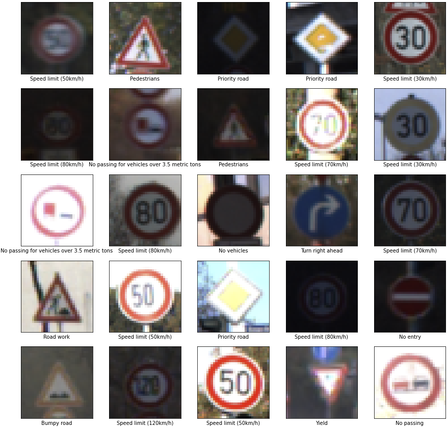
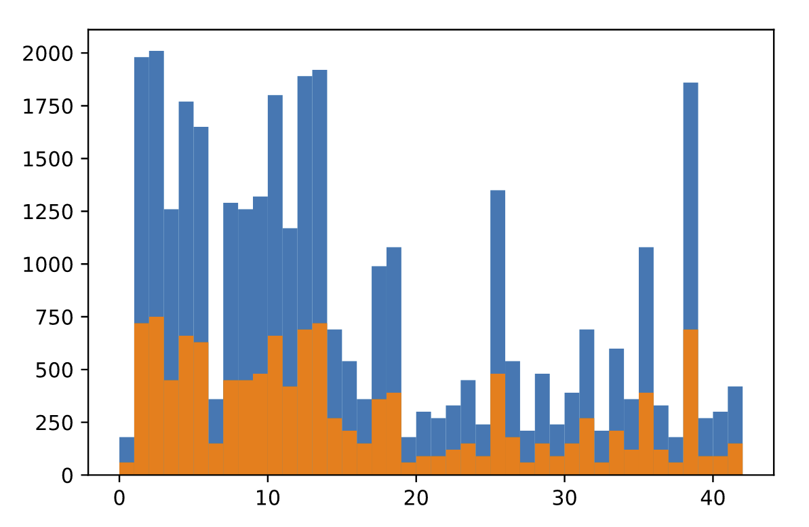
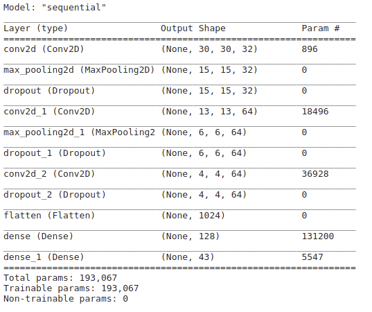
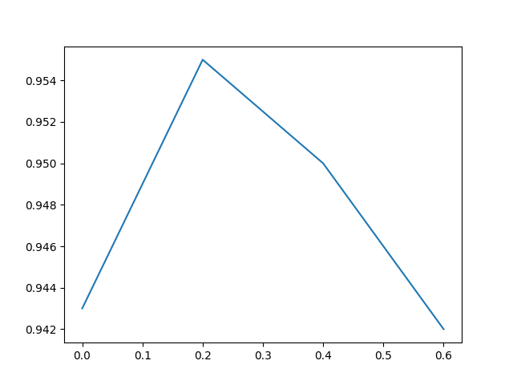
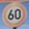
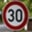

# **Traffic Sign Recognition** 

In this project, We built a traffic sign classifier with Convolutional Neural Network using python and tensorflow.

The steps of this project are the following:
* Load the data set
* Explore, summarize and visualize the data set
* Design, train and test a model architecture
* Use the model to make predictions on new images
* Analyze the softmax probabilities of the new images
* Summarize the results

## **Data Set Summary & Exploration**

The dataset used in this project is from [German Traffic Sign Dataset](https://benchmark.ini.rub.de/?section=gtsrb&subsection=dataset). 
It contains images of german traffic signs. All images are labeled. The file signnames.csv contains id to class name mappings.
The testing set contains 34799 images. The validation set contains 4410 images. The testing set contains 12630 images. Each image is 32 by 32 by 3. There are a total of 43 unique labels/classes.

Here are 25 random sample images from the training set:

Here is the distribution of labels in the training set and testing set:

## Design, Train, and Test the Model Architecture

### Preprocessing

To make the training more efficient, we normalize the image data so that it has zero mean and equal variance.

### Model Architecture
We used a stack of Conv2D, MaxPooling2D, and Dropout layers. Then, we added some fully connected dense layers on top.

The input takes tensors of shape(image_height, image_width, color_channels).

The output is tensors of shape (number_of_classes=43).

Here is the complete architecture of our model:

### Compile and Train the Model
The optimizer we chose is adam. Adam optimization algorith is an extension to stochastic gradient descent that is very popular of deep learning.
The loss function we chose is cross entropy. The evaluation metric is accuracy. The batch size is not neccesary for tf2.
In the final model, we use these parameters:
* number of epochs: 10
* dropout rate: 20%

We used an iterative approach on choosing the best dropout rate. We try with model with the following dropout rates: 0, 0.2, 0.4, 0.6. We found that a dropout rate of 0.2 yield the best accuracy.

Accuracy vs Dropout rate:

### Evaluate the Model

Our final model results were:
* training set accuracy: 0.986
* validation set accuracy: 0.966
* test set accuracy: 0.955

We think the the model is very pretty accurate.

## Test the Model on New Images

We also tested the model on 5 images form the web.

Here are five German traffic signs that we found on the web:

The second image is relatively difficult to predict because it is taken at an angle.

Our model is able to predict all 5 images accurately.

The softmax probabilities showed that the model is predicting the correct class with almost 100% confidence, for all 5 images.
